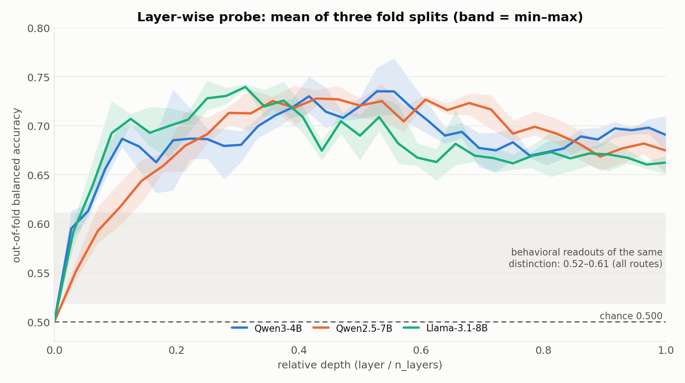
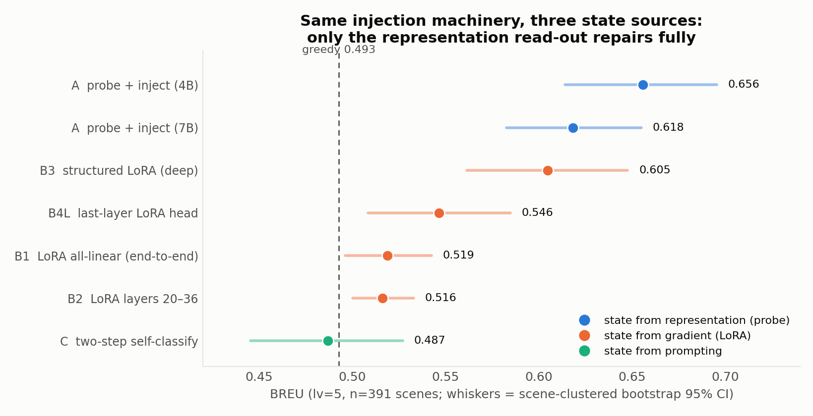
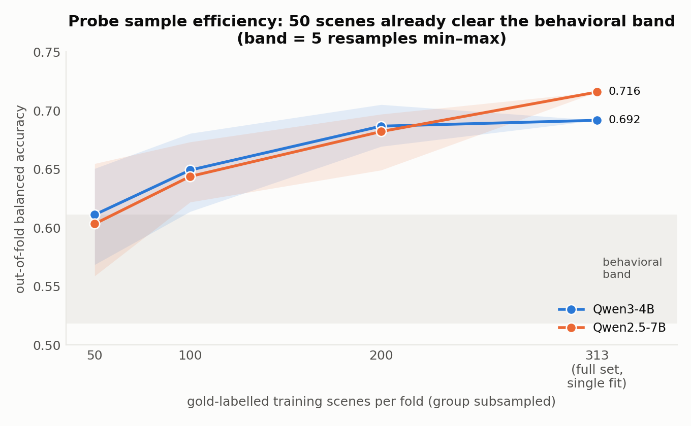
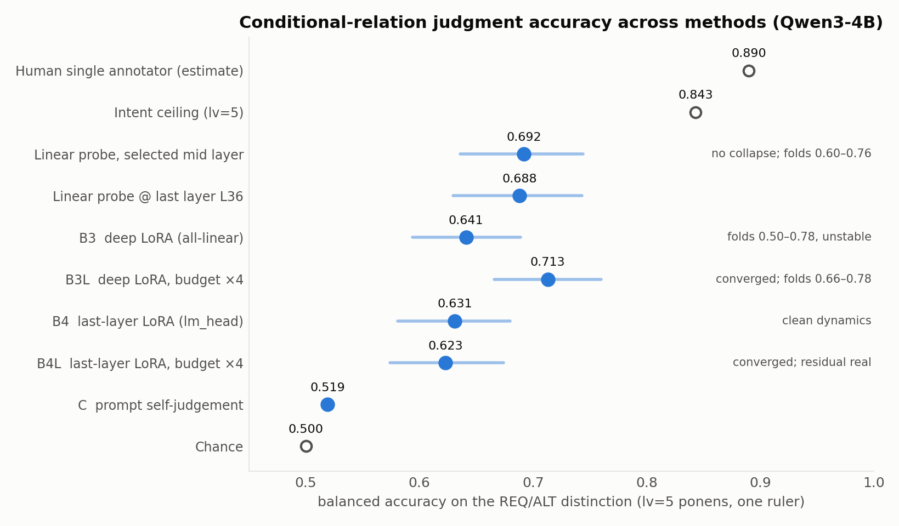
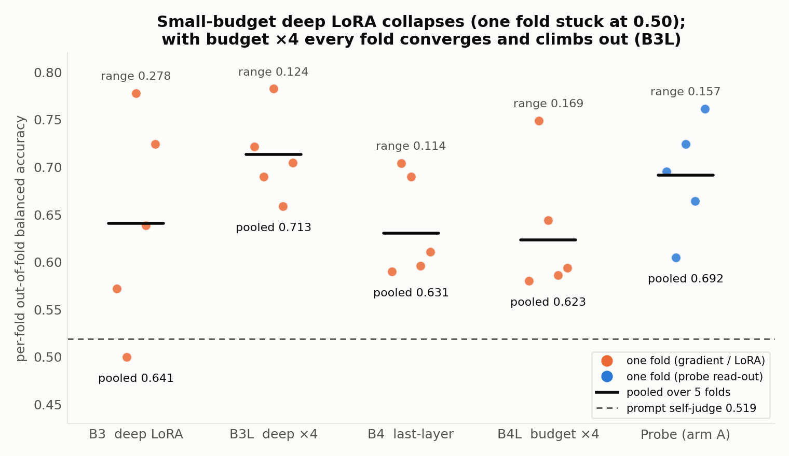
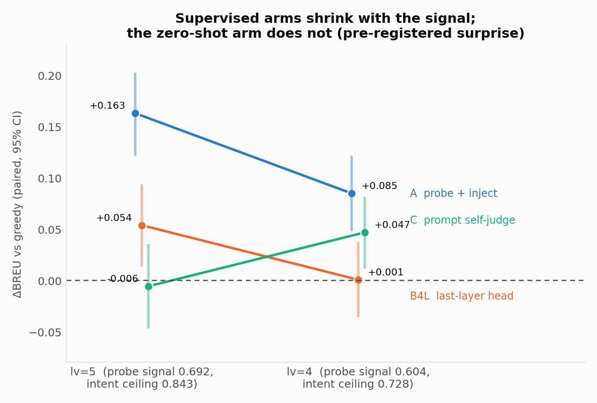

# Belief-R 实验报告

## 摘要

本实验是关于 SAVI 在 Belief-R 上的应用。这个 benchmark 要求模型在原有推理上追加一句新条件后决定是否收回结论,答案取决于这句话应读作原推理的必要前提还是通往同一结论的替代路径。根据实验结果,该关系判断一旦直接给出,模型即可正确执行(准确率 **0.006 → 0.994**),但模型无法自行得到它:四种从输出分布读取的方法均停留在 0.52–0.61,提示类干预的增益为 0。

在方法上,使用探针作为检测手段,主要实验结果有：(i)**该判断在中间层线性可读**:三个模型(Qwen3-4B、Qwen2.5-7B、Llama-3.1-8B)的准确率为 0.706–0.718(三套折划分均值;原划分 0.692–0.734),逐层曲线在中间层达峰;行为端 0.52–0.61 与探针之间的缺口本身,说明判断被算出但没有被接到输出上。(ii)将探针给出的判断按模板写回提示后,**作答得到修复**(4B 的 BREU 由 0.493 升至 0.656,7B 提升 0.127)。(iii)以同一份标注微调模型(LoRA):只动输出投影(lm_head)的微调收敛后停在 0.62–0.63,与探针差 −0.069 显著,预算放大 4 倍原地踏步——"训练不足"在末层被排除;深层微调在小预算下整折塌缩,**预算放大 4 倍后五折全部收敛、达到 0.713,与探针配对不可区分(追平)**——塌缩是预算不足,不是深层学不到。(iv)在标注者一致度较低、表征信号更弱的题目上(探针 0.692 → 0.604),两条依赖标注的路线增益同步缩小,表明**增益随表征中可读信号的强度变化**,而非来自模板改写本身。此外,探针的标注成本较低:50 个标注场景即超过全部输出侧读法。

---

## 0. 实验目的 & 主要结论:
在 MuSR 实验的基础上，进一步研究模型信念问题，并研究 SAVI 在该问题上的应用与相关机制解释。

**主要结论**
1. **信号在中间层**: 冻结模型,对各层隐藏状态训线性分类器(下称"探针"),三个模型(两个家族)都能读出判断(三套折划分均值 0.706–0.718);从输出读取只有 0.52–0.61,与探针之间的缺口说明判断被算出、但没有被接到输出上。
2. **写回即修复**: 探针判断按固定模板写回提示,4B 总分 0.493 → 0.656(+0.163,显著;7B +0.127)。
3. **微调追平探针需要"深层 + 足够预算"**: 同一份标注去微调(LoRA),只动输出投影(lm_head)的臂收敛后停在 0.623——与探针差 −0.069 显著,预算放大 4 倍原地踏步,"训练不够"在末层被排除;深层臂在小预算下整折塌缩(0.641),**预算放大 4 倍后五折全部收敛、达到 0.713,与探针配对不可区分(追平)**。探针保留的独特优势是:免训练、无塌折、样本效率。
4. **增益跟着表征里的信号走**: 在信号更弱的题上(探针 0.692 → 0.604),两条依赖标注的路线提升同步缩小(另有一处与预期相反的对照,来源未明,见 §5)。
5. **标注成本低**: 探针用 50 个标注场景就超过全部输出侧读法, 200 个接近全量水平。

同一把尺(lv=5 关系判断准确率,均为 4B)下:模型自我判断 0.519,末层微调 0.623–0.631(不塌但停在平台,预算 ×4 原地踏步),深层微调 0.641(小预算,五折交叉检验会塌折)→ **预算 ×4 后 0.713(全收敛,追平探针)**,探针 0.692(三划分均值 0.706;不塌,免训练);按出题意图作答的上限 0.843。

---

## 1. 数据集与指标

**Belief-R**(EMNLP 2024)的题目形式:先给两个前提——"若 p 则 q"和"p"——模型得出结论;再补一句关于新条件 r 的话。这句话有两种读法:

- **REQ**(必要条件):r 是原推理的前提,r 不成立就该收回结论——**要改答案**;
- **ALT**(替代路径):r 是通往同一结论的另一条路——**不该改答案**。

两种读法在逻辑上都说得通,选哪种靠语用直觉(说话人为什么要提 r)。

**lv(`agreement_lv`)**:原论文每道题由 5 名标注者各自答题,**金标 = 得票最多的选项**;lv 记录同意胜出选项的人数——lv=5 是 5 人全同,lv=4 是 4:1。主实验用 lv=5(391 个场景),lv=4(479 个)做对照。

**题目实例**:
```
<basic>
If John reads a book, then John learns something new
John reads a book

What necessarily had to follow assuming that the above premises were true?
(a) John learns something new
(b) John does not learn something new
(c) John may or may not learn something new

<BU>(在 basic 基础上追加一句)
If Jessica explains quantum physics to John for the first time,
then John learns something new

<输入> = 原文 + 作答格式要求(Final Answer [X]),可选 CoT / Plan-and-Solve 前缀
```

**几组成对概念**:

- **ponens / tollens**:同一组前提问两道题。ponens 顺着问(给"p 成立"问 q,如上例);tollens 反着问(给"q 没成立"问 p,作答前要先倒推一步)。
- **BU / BM 与 REQ/ALT**:同一枚硬币的两面。金标把新句读成 **REQ** 的场景就是 **BU**(belief-update,该改答案:a→c 或 b→c);读成 **ALT** 的就是 **BM**(belief-maintaining,答案不变)。**REQ/ALT 指的是新增条件与原条件的关系,BU/BM 说的是该不该改答案。**
- **答案字母**:REQ 场景两种问法的正确答案都是 (c); ALT 场景 ponens 答 (a)、tollens 答 (b)。

**数据总览**(每场景 = ponens + tollens 两道题):

| 标注一致度 | 场景数 | 题目数 | BU (REQ) | BM (ALT) |
|---|---|---|---|---|
| lv=5(5/5) | 391 | 782 | 257 | 134 |
| lv=4(4/5) | 479 | 958 | 278 | 201 |
| lv=6(异常,排除) | 2 | 4 | 2 | 0 |
| **合计** | **872** | **1,744** | 537 | 335 |

**评估指标**:

- **准确率(bal-acc)**:REQ、ALT 两类各算正确率再平均;随机猜测为 0.500。
- **AUC**:随机抽一道 REQ 题和一道 ALT 题,打分器把 REQ 排在 ALT 之上的概率。
- **BREU**:该改答案的题(BU)与不该改的题(BM)各算正确率再平均 ("逢题就改"或"从不改"都只能拿约 0.5)。
- **SM 子集**:本数据集有一个已知缺陷——只数新补句子与原前提的**字符数之差**就能预测标签(AUC 0.800)。SM 是把长度配平后剩下的 178 个场景,长度线索在其上失效。**读法:准确率只在全集涨、SM 上不涨 = 学到的是句长,不是关系。**
- **上限**:0.843 = 完全按出题人设计意图作答、对金标能拿到的分(lv=5;SM 上 0.764,lv=4 上 0.728)。(**注意**其不等同于人类准确率,推算得单个标注者与金标的一致率约 0.890)。
- **"显著"的声明**:全文的"显著"指**95% 置信区间不含 0**。强调的是**方向可靠**,不是单纯效应大。

---

## 2. 发现一:判断在中间层里,输出里没有

#### 实验设计

模型只做前向计算,取每层隐藏状态,训逻辑回归探针给出 REQ/ALT 分类结果。

#### 实验结果
> **下表读法**: 前两列是主读数,越高越好,随机 0.5;**SM 子集** = 长度配平后的成绩(仍明显高于 0.5 = 读的不是句长);**词面基线** = 使用题面原文做 TF-IDF(1–2 词组) + 逻辑回归的分类器,**完全不经过模型**,验证的是"探针读到的东西,是不是题面文字里数词频就能数出来的"。

| 模型 | 准确率 [95% CI] | AUC | SM 子集 [95% CI] | 比词面基线高出 |
|---|---|---|---|---|
| Llama-3.1-8B | 0.709 [0.657, 0.755](原 0.734) | 0.802 | 0.601 [0.541, 0.659] ✅ | +0.177 |
| Qwen2.5-7B | **0.718** [0.673, 0.761](原 0.716) | 0.771 | 0.635 [0.570, 0.701] ✅ | +0.159 |
| Qwen3-4B | 0.706 [0.658, 0.753](原 0.692) | 0.763 | 0.624 [0.554, 0.691] ✅ | +0.135 |

>**注**:准确率与 SM 两列报**三套折划分的均值及其 95% 聚类 bootstrap CI**。**SM 列判据 = 均值 CI 下缘高出词面基线在 SM 上的参照线 0.528**。



> **图 1** 三个模型逐层的探针准确率(实线 = 三套折划分的均值,彩色带 = 三套划分的最小–最大范围;横轴为相对深度)。三条曲线同一形状:词嵌入层恰好 0.500、**中间层最高**。**灰色带** = 从模型输出读的各种办法的成绩范围(0.52–0.61)。

#### 结论
1. **判断在中间层里线性可读**;从输出侧读不出来(0.52–0.61)。
2. **不是记选项字母**: 用 ponens 版训、tollens 版测,准确率相近(0.675/0.644)。两版正确选项字母不同,说明记的是关系。
3. **似然打分为何失败**: 判断到最后一个隐藏层仍线性可读(4B 末层 0.688),但模型的输出通路没有把它接到答案上——缺口在"用",不在"有"。

---

## 3. 发现二:把探针的判断写回提示,能够修复行为

#### 实验设计

- **A 探针组**: 与发现一同款前向取中间层,由**没在这道题上训练过的那一折**探针给出判断(五折交叉,断言钉死,探针永远不在见过的题上"修复");
- **C 自我判断组**: 模型先答一道"这句话是必要条件还是替代路径"的选择题, 用它的答案走同 A 组的第二步;
- **B1/B2 微调组**: 用同一份标注把模型端到端微调(监督 = 最终答案;B1 改全部层,B2 改后 17 层), 微调后的模型直接答原题, 检验"同样的信息走权重更新这条路是否可行";
- **执行步骤**(A、C 共用,唯一变量是判断从哪来):第一步得到这道题的 REQ/ALT 判断;第二步按固定模板把判断写成一句明确的条件句、替换原题前提,交给**未改动的原模型**作答。

> **注意**:微调组 B 直接给出答案,对比于 A、C 两组先判断再组合输入文本的两阶段方式并不公平(B1/B2 学的是最终答案,不是关系判断),后续补充了结构匹配的对照实验(§4)。

**第二步的例子(沿用 §1 例子)**:

```
判断 = REQ(必要)→ 前提改写成 and 型:
  (i) The fact that John reads a book does not by itself bring it about that
      John learns something new; that happens only if in addition Jessica
      explains quantum physics to John for the first time.
  (ii) John reads a book

判断 = ALT(替代)→ 前提改写成 or 型:
  (i) The fact that John reads a book by itself brings it about that John
      learns something new; and the fact that Jessica explains quantum physics
      to John for the first time by itself also brings it about that John
      learns something new.
  (ii) John reads a book
```

#### 实验结果(数字见图 2)
| 方法 | BREU | 比直接作答 | 判定 |
|---|---|---|---|
| A 探针(4B / 7B) | **0.656** / 0.618 | **+0.163** / +0.127,均显著 | 修复成立(7B 部分成立,短板在执行:听从注入的比例 0.830 vs 4B 0.939) |
| B1/B2 微调 | 0.519 / 0.516 | 全集微涨,SM 上不涨 | 未修复:按 §1 的 SM 读法,学到的是句长 |
| C 自我判断 | 0.487 | 无差别 | 符合预期 |



> **图 2** 各方法的 BREU(lv=5,391 场景;横线 = 95% 置信区间;竖虚线 = 模型直接作答的 0.493)。**颜色 = 第一步的判断从哪来**: 蓝 = 读中间层表征; 橙 = 梯度更新后的权重(微调); 青绿 = 模型自生成结果。



> **图 3** 探针要多少人工标注样本。横轴 = 每折训练用的标注场景数,纵轴 = 未见过的折上的准确率;50/100/200 三档各随机抽 5 次,阴影 = 5 次的最好/最差。313 档为全量, 只训一次,无最好/最差之分。

#### 结论 
1. **起作用的是判断的来源。** 第二步逐字相同,判断来自探针 → 0.656,来自模型自判 → 0.487;而把同一份标注拿去微调只有 0.519,且只在全集涨、SM 上不涨,它学到的是句长。
2. 探针的标注样本效率较高(50 个场景已超过全部输出侧读法)。

---

## 4. 发现三:同一份标注,微调追平探针需要"深层 + 足够预算"

#### 实验设计

在发现二基础上补的结构匹配对照:把微调的训练目标**换成与探针相同的关系判断**(输出 `RELATION: 1/2`,不再学最终答案),检验微调能否追平探针。四个变体只变动作用位置与预算(两个位置互不重叠:深层组含全隐层、不含 lm_head;末层组只动 lm_head):

- **B3**:LoRA 加在所有层的块内线性投影(q/k/v/o/gate/up/down);
- **B3L**:B3 的训练预算放大 4 倍;
- **B4**:LoRA 只加在最后的输出投影(lm_head);
- **B4L**:B4 的训练预算放大 4 倍(区分"训练不够"与"真上限")。

#### 实验发现(数字见图 4 和 图 5):

- **深层微调在小预算下会塌**:B3 五折都从"全预测 REQ"的塌缩起步,有一折整折没爬出来(逐折 0.500–0.778),只动输出层的 B4 不塌(0.590–0.704);
- **深层的塌缩是预算不足,不是学不到**:B3L 把预算放大 4 倍,五折全部收敛、全部爬出(逐折 0.659–0.782),准确率 **0.713**——比 B3 高 +0.073(显著)、比 B4L 高 +0.090、**与探针差 +0.022,追平**;
- **末层的差距不是训练不够**:B4L 把预算放大 4 倍、五折全部收敛,准确率 0.623,与 B4 无差别(−0.0075),与探针差 −0.069 仍显著——只修输出投影层不够;



> **图 4** 同一指标下的每条路(lv=5 关系判断准确率,全部 4B)。空心灰点 = 参照(上限/人类/瞎猜), 蓝点 = 实测, 横线 = 95% 置信区间。



> **图 5** 五折交叉验证 两个点:**B3(深层微调、小预算)有一整折卡死在 0.50 的瞎猜水平;预算 ×4 的B3L 五折全部爬出(最差 0.659),整体抬到 0.713**。探针的优势是"免训练且从不崩盘", 不是"波动更小"(波动幅度同量级)。

#### 结论

1. 修输出投影有提升(0.519 → 0.631),说明末层状态里确有可用信号;但收敛后仍差探针 −0.069(显著),预算放大也不动——只修投影不够;
2. 全层(块内)微调在预算放开后追平探针(0.713 vs 0.692,不可区分)——深层塌缩是预算不足,不是学不到;**可修复的余量在隐藏层内的计算,不在输出投影**。

---

## 5. 发现四:信号弱的题上提升变小

#### 实验设计

把三种方法放到 lv=4 的题上测试。这部分题目标注者之间存在分歧(4:1 而非 5:0),且"标注多数票与出题人预设不一致"的比例是 lv=5 的两倍多(24.2% vs 11.3%)。若修复的提升来自探针信号,信号弱则提升小;C(自判)不依赖这个信号,提升应约为 0。

#### 实验发现 (数字见 图 6)

- **两条监督路线(探针、微调)的提升都随信号变弱而缩小**,这回答的是增益的**来源**。修复流程分两半:先拿到一个 REQ/ALT 判断,再按固定模板把它写回提示。若增益来自改写模板这个动作本身(把前提写得更明确,谁来判断都一样),提升就不该随题目组变化。实测恰恰相反:提升跟着表征里可读信号的强弱(0.692 → 0.604)同步缩小,而写回一个约等于瞎猜的判断没有增益(C 组在 lv=5 上判断准确率只有 0.519,提升 −0.006)。**所以增益来自判断本身,而判断的正确性来自表征里读出的信号,不是来自模板。**
- **C 组这个对照反了**: 零样本自判对金标的准确率从 0.519 升到 **0.5605**(REQ、ALT 两侧分别 0.574 / 0.547,都过 0.5,不是偏答某一类得到提升的);把这个判断按同一套模板写回提示再作答,端到端提升 +0.047。

| 方法 | 提升(lv=5)[95% CI] | 提升(lv=4)[95% CI] | 判读 |
|---|---|---|---|
| A 探针 | **+0.163** [+0.123, +0.202] | **+0.085** [+0.049, +0.121] | 符合预期:缩小但区间仍不含 0 |
| B4L 末层微调 | +0.054 [+0.014, +0.093] | +0.001 [−0.035, +0.036] | 符合预期:缩到与 0 不可区分 |
| C 自我判断 | −0.006 [−0.046, +0.034] | **+0.047** [+0.013, +0.080] | **对照反了**(事先没料到) |



> **图 6** 各方法相比模型直接作答的提升,lv=5 → lv=4(竖线 = 95% 置信区间)。

#### 结论
1. **提升随着信号变弱而下降**——增益来自表征里的判断,不是来自改写模板这个动作。
2. **C 组的意外结果。** 测过的候选解释是"模型更像普通读者、不像出题人":把题按"标注多数票与出题意图是否同向"分成两组重算。结果是**"跟读者"未获支持**——分歧组上自判 0.530、置信区间含0.5;lv=4 的优势其实出现在读者与出题人**一致**的题上。但这**不等于**"模型更像出题人":检验结果落在"判不确定"一档。**该问题未有明确答案**

---

## 6. 局限 与 SAVI联系

1. **"读得出"不等于"模型在用"**: 虽然探针能够检测出模型内部在处理过程中涉及相关信息，但无法证明模型自己确实在使用这条信息。
2. **数据集自身的缺陷**: 标签能被两句的长度差预测,AUC 0.800;长度配平后上限只有 0.764。
3. **给"候选从哪来"和"怎么给候选打分"这两件事各添了一条证据。**
  i. 这个数据集是"采样池里根本没有正确答案"的极端例子:采样 16 次,要改答案的题有 91–96% 一次都没写出正确答案;**把采样池翻倍到 32 次,该比例仍有 88–95%**(机械口径判定为不确定档)——多数投票和 Best-of-N 无从下手;
  ii. 改成"把候选列全 + 打分 + 选择 + 按选择执行",就能拿回答案。而这个打分器可以就是模型自己的中间层加一个线性头:同一次前向免费产出。
4. **没有对多步解码策略的支持。** 这个任务只有两步,第二步是确定性的,全局解码、搜索、多步累积在此派不上用场。

---

## 7. 代码索引

路径相对本报告目录。复现顺序:先跑 `code/run/*`(需 GPU),再跑 `code/summarize/*`(纯 CPU),最后 `code/figures/*` 出图。

| 类别 | 路径 |
|---|---|
| 实验脚本(需 GPU) | `code/run/*` |
| 重算脚本(纯 CPU) | `code/summarize/*` |
| 作图 | `code/figures/*` |
| 来源与 sha256 校验 | `code/MANIFEST.md` |

